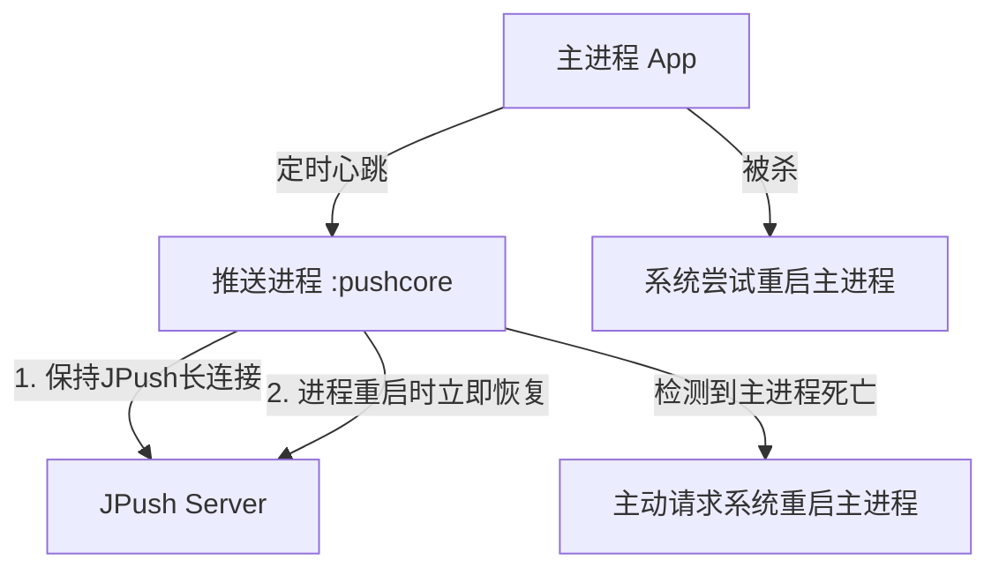

# JPush 推送延迟优化方案

> 问题描述：手机长时间亮屏（前台服务运行），当前台服务因系统回收关闭后，需要等待约 2 分钟才能收到推送消息。

---

## P0 快速修复（立即实施）

### 1. 修改 TalkBackgroundWorker

**文件**: `app/src/main/java/com/nextcloud/talk/jobs/clps/TalkBackgroundWorker.kt`

**改动**：
1. 调用 `JPushInterface.resumePush()` — 主动恢复推送（原代码只 `getPushStatus()` 查询不恢复）
2. 检查 RegistrationID，为空则重新 `init()`
3. RegistrationID 变化时，重新注册到 Nextcloud 服务器
4. 移除废弃的 `makeGetRequest()` 方法（泄露 MasterSecret）

### 2. 修改 initPush()

**文件**: `app/src/main/java/com/nextcloud/talk/application/NextcloudTalkApplication.kt`

**改动**：
1. 回到前台时：`resumePush()` + 检查 RegistrationID 变化（原只 `getPushStatus()`）
2. 网络恢复时：`resumePush()` — 主动重建长连接（原只 `getPushStatus()`）
3. `setRequiresBatteryNotLow(false)` — 低电量时也执行保活
4. Backoff 间隔从 30 分钟改为 30 秒 — 失败后快速重试

## 1. 问题根因分析

### 1.1 当前架构

```
应用进程存活（前台服务保持）
    ↓ 系统内存紧张/长时间无前台服务
应用进程被系统杀死
    ↓ 系统延迟（约2分钟）
系统向极光推送服务进程发送消息
    ↓
JPush 重建进程 → 重新建立长连接 → 收到推送通知
```

### 1.2 延迟原因链

| 环节 | 时间损耗 | 说明 |
|------|---------|------|
| **系统杀死进程** | 0 | 系统自己决定 |
| **系统重新调度进程** | **30-90秒** | Android 12+ 的 App Standby Bucket 策略会将应用加入 Restricted Bucket，进程重启优先级极低 |
| **JPush 重建长连接** | **15-30秒** | 进程被杀死后 JPush 长连接断开，重新建立 TCP/TLS 连接需要 DNS 解析 + 握手 |
| **WorkManager 调度延迟** | **30-60秒** | `PeriodicWorkRequest` 的最小间隔是 15 分钟，不能用于加速推送 |
| **厂商通道注册延迟** | **10-30秒** | 进程重启后需要重新注册厂商通道 Token |

### 1.3 当前代码问题点

```kotlin
// TalkBackgroundWorker.kt — 当前保活逻辑的问题
// 1. 实际只调用 getPushStatus() 做检查，不重启推送
JPushInterface.getPushStatus(context);

// 2. 注释掉的 resumePush() 逻辑可能正是需要的
// JPushInterface.resumePush(applicationContext)

// 3. PeriodicWork 最小 15 分钟，无法做到秒级保活
val periodicPushCheckWork = PeriodicWorkRequest.Builder(
    TalkBackgroundWorker::class.java,
    15, TimeUnit.MINUTES  // ← 15分钟间隔太长了
)
```

---

## 2. 优化方案

### 方案一：完善 JPush 长连接自动恢复（推荐，最根本）

JPush 本身有自动重连机制，但需要确保：

1. **不要在 `onCommandResult` 中意外调用 `resumePush`**
2. **确保应用被杀死后，JPush 的服务进程（:pushcore）能独立存活**

当前已有 `CJCommonService`（继承 `JCommonService`）在独立进程 `:pushcore` 运行：

```xml
<service android:name="com.nextcloud.talk.jpush.CJCommonService"
    android:enabled="true"
    android:exported="false"
    android:process=":pushcore" />
```

**这是正确的配置特性**，还需要确保 JPush 的 `JCommonService` 在主进程被杀后能独立继续工作。

### 方案二：双进程心跳保活（主要措施）

创建低功耗的**双进程守护**机制，确保 JPush 长连接进程存活：



### 方案三：静默推送 + 定时心跳

利用手机的 `AlarmManager` 设置**精确闹钟**（不受 Doze 模式影响），每 5 分钟唤醒一次检查推送状态：

```
Android 12+ 的 Exact Alarm 权限：
1. 声明 SCHEDULE_EXACT_ALARM 权限
2. 用户需要在系统设置中授权
3. 或使用 USE_EXACT_ALARM 权限（自动授予）
```

### 方案四：厂商通道完整集成（最推荐，解决根本问题）

| 厂商 | 当前配置 | 状态 |
|------|---------|------|
| 小米 | `XIAOMI_APPID`, `XIAOMI_APPKEY` 已配置 | ✅ 已配置 |
| 华为 | 无 HUAWEI_APPID | ❌ 未配置 |
| OPPO | `OPPO_APPKEY`, `OPPO_APPID`, `OPPO_APPSECRET` 已配置 | ✅ 已配置 |
| VIVO | `VIVO_APPKEY`, `VIVO_APPID` 已配置 | ✅ 已配置 |
| 荣耀 | `HONOR_APPID` 已配置 | ⚠️ 需确认完整配置 |

**厂商通道原理**：
```
应用被杀 → 推送消息 → 极光服务器 
    → 通过厂商推送通道（华为/小米/OPPO/VIVO）
    → 手机系统级推送服务（永不杀死）
    → 系统拉起应用进程
```

**这是解决"被杀后收不到推送"的最可靠方案**，因为厂商通道运行在系统级进程中。

---

## 3. 优化代码实现

### 3.1 修复 TalkBackgroundWorker（立即生效）

```kotlin
// app/src/main/java/com/nextcloud/talk/jobs/clps/TalkBackgroundWorker.kt

@AutoInjector(NextcloudTalkApplication::class)
class TalkBackgroundWorker(context: Context, workerParams: WorkerParameters) : 
    CoroutineWorker(context, workerParams) {

    @Inject
    lateinit var appPreferences: AppPreferences

    override suspend fun doWork(): Result {
        NextcloudTalkApplication.sharedApplication!!.componentApplication.inject(this)
        
        Log.d(TAG, "TalkBackgroundWorker 推送保活检查: ${
            SimpleDateFormat("yyyy-MM-dd HH:mm:ss", Locale.getDefault()).format(Date())
        }")

        // 1. 检查推送状态（如果停止则恢复）
        JPushInterface.resumePush(applicationContext)
        
        // 2. 重新获取 RegistrationID，确保 tokens 未过期
        val registrationId = JPushInterface.getRegistrationID(applicationContext)
        if (registrationId.isNullOrEmpty()) {
            // RegistrationID 为空说明推送服务未就绪，重新初始化
            JPushInterface.init(applicationContext)
        }
        
        // 3. 检查厂商通道 token（如果配置了厂商推送）
        JPushInterface.getPushStatus(applicationContext)
        
        // 4. 重新注册到 Nextcloud 服务器（如果 token 变化了）
        val storedToken = appPreferences.pushToken
        if (registrationId != null && registrationId != storedToken) {
            appPreferences.pushToken = registrationId
            schedulePushRegistration(applicationContext)
        }
        
        return Result.success()
    }
    
    private fun schedulePushRegistration(context: Context) {
        val data = Data.Builder()
            .putString(PushRegistrationWorker.ORIGIN, "TalkBackgroundWorker")
            .build()
        val work = OneTimeWorkRequest.Builder(PushRegistrationWorker::class.java)
            .setInputData(data)
            .build()
        WorkManager.getInstance(context).enqueue(work)
    }

    companion object {
        private val TAG = TalkBackgroundWorker::class.simpleName
    }
}
```

### 3.2 降低 WorkManager 保活周期

```kotlin
// app/src/main/java/com/nextcloud/talk/application/NextcloudTalkApplication.kt

private fun initPush() {
    JPushInterface.setDebugMode(BuildConfig.DEBUG)
    JPushInterface.init(this)
    JPushInterface.getPushStatus(this)

    // 监听应用前后台切换
    ProcessLifecycleOwner.get().lifecycle.addObserver(object : DefaultLifecycleObserver {
        override fun onStart(owner: LifecycleOwner) {
            // 应用回到前台时：主动恢复推送 + 刷新 RegistrationID
            JPushInterface.resumePush(applicationContext)
            val registrationId = JPushInterface.getRegistrationID(applicationContext)
            if (!registrationId.isNullOrEmpty() && registrationId != appPreferences.pushToken) {
                appPreferences.pushToken = registrationId
                schedulePushRegistration(applicationContext)
            }
        }

        override fun onStop(owner: LifecycleOwner) {
            // 应用进入后台：主动获取一次 RegistrationID，确保 token 正确
            JPushInterface.getPushStatus(applicationContext)
        }
    })

    // 网络恢复时立即恢复推送
    ...

    // 启动保活周期任务
    schedulePushKeepAliveWork()
}

private fun schedulePushKeepAliveWork() {
    val constraints = Constraints.Builder()
        .setRequiredNetworkType(NetworkType.CONNECTED)
        .setRequiresDeviceIdle(false)
        .setRequiresBatteryNotLow(false)  // 不要求电量
        .build()

    val periodicWork = PeriodicWorkRequest.Builder(
        TalkBackgroundWorker::class.java,
        15, TimeUnit.MINUTES
    )
        .setConstraints(constraints)
        .setBackoffCriteria(
            BackoffPolicy.EXPONENTIAL,
            30, TimeUnit.SECONDS  // 缩短失败重试间隔
        )
        .build()

    WorkManager.getInstance(applicationContext).enqueueUniquePeriodicWork(
        "PushStatusCheckWork",
        ExistingPeriodicWorkPolicy.KEEP,
        periodicWork
    )
}
```

### 3.3 新增 AlarmManager 精确保活

```kotlin
// app/src/main/java/com/nextcloud/talk/jobs/clps/AlarmBasedPushKeeper.kt

package com.nextcloud.talk.jobs.clps

import android.app.AlarmManager
import android.app.PendingIntent
import android.content.Context
import android.content.Intent
import android.os.Build
import android.os.SystemClock
import android.util.Log
import cn.jpush.android.api.JPushInterface

/**
 * 基于 AlarmManager 的推送保活器。
 *
 * 应用被杀后，AlarmManager 通过"精确闹钟"在指定时间
 * 触发广播接收器，执行推送保活检查。
 * 适用于 Android 12+，需要 SCHEDULE_EXACT_ALARM 权限。
 */
class AlarmBasedPushKeeper {

    companion object {
        private const val TAG = "AlarmBasedPushKeeper"
        private const val REQUEST_CODE = 48001
        private const val ALARM_INTERVAL_MS = 5 * 60 * 1000L  // 5分钟
        const val ACTION_PUSH_KEEP_ALIVE = "com.nextcloud.talk.action.PUSH_KEEP_ALIVE"
    }

    fun start(context: Context) {
        val alarmManager = context.getSystemService(Context.ALARM_SERVICE) as AlarmManager
        val intent = Intent(ACTION_PUSH_KEEP_ALIVE)
        val pendingIntent = PendingIntent.getBroadcast(
            context,
            REQUEST_CODE,
            intent,
            PendingIntent.FLAG_IMMUTABLE or PendingIntent.FLAG_UPDATE_CURRENT
        )

        // 优先使用精确闹钟（不受 Doze 模式限制）
        if (Build.VERSION.SDK_INT >= Build.VERSION_CODES.S &&
            alarmManager.canScheduleExactAlarms()
        ) {
            alarmManager.setExactAndAllowWhileIdle(
                AlarmManager.ELAPSED_REALTIME_WAKEUP,
                SystemClock.elapsedRealtime() + ALARM_INTERVAL_MS,
                pendingIntent
            )
        } else {
            alarmManager.setAndAllowWhileIdle(
                AlarmManager.ELAPSED_REALTIME_WAKEUP,
                SystemClock.elapsedRealtime() + ALARM_INTERVAL_MS,
                pendingIntent
            )
        }

        Log.d(TAG, "AlarmBasedPushKeeper started, interval=${ALARM_INTERVAL_MS}ms")
    }

    fun stop(context: Context) {
        val alarmManager = context.getSystemService(Context.ALARM_SERVICE) as AlarmManager
        val intent = Intent(ACTION_PUSH_KEEP_ALIVE)
        val pendingIntent = PendingIntent.getBroadcast(
            context,
            REQUEST_CODE,
            intent,
            PendingIntent.FLAG_IMMUTABLE or PendingIntent.FLAG_NO_CREATE
        )
        pendingIntent?.let { alarmManager.cancel(it) }
        Log.d(TAG, "AlarmBasedPushKeeper stopped")
    }
}
```

### 3.4 新增 PushKeepAliveReceiver

```kotlin
// app/src/main/java/com/nextcloud/talk/jobs/clps/PushKeepAliveReceiver.kt

package com.nextcloud.talk.jobs.clps

import android.content.BroadcastReceiver
import android.content.Context
import android.content.Intent
import android.util.Log
import cn.jpush.android.api.JPushInterface

/**
 * 接收 AlarmManager 定时广播，执行推送保活检查。
 * 应用被杀后，系统仍可触发此 Receiver。
 */
class PushKeepAliveReceiver : BroadcastReceiver() {

    override fun onReceive(context: Context, intent: Intent) {
        if (intent.action != AlarmBasedPushKeeper.ACTION_PUSH_KEEP_ALIVE) return
        Log.d(TAG, "PushKeepAliveReceiver triggered")

        try {
            // 确保 JPush 推送通道存活
            JPushInterface.resumePush(context)
            JPushInterface.getPushStatus(context)

            val registrationId = JPushInterface.getRegistrationID(context)
            Log.d(TAG, "RegistrationID = $registrationId")

            // 重新调度下一次闹钟
            AlarmBasedPushKeeper().start(context)
        } catch (e: Exception) {
            Log.e(TAG, "PushKeepAliveReceiver failed", e)
        }
    }

    companion object {
        private const val TAG = "PushKeepAliveReceiver"
    }
}
```

### 3.5 AndroidManifest 声明

```xml
<!-- 添加到 AndroidManifest.xml -->

<!-- alarm 保活广播接收器 -->
<receiver
    android:name="com.nextcloud.talk.jobs.clps.PushKeepAliveReceiver"
    android:enabled="true"
    android:exported="false" />

<!-- 精确闹钟权限（Android 12+） -->
<uses-permission android:name="android.permission.SCHEDULE_EXACT_ALARM" />
```

### 3.6 在 Application 中初始化

```kotlin
// 添加到 NextcloudTalkApplication.kt 的 initPush() 末尾

// 启动 AlarmManager 精确保活
if (Build.VERSION.SDK_INT >= Build.VERSION_CODES.S) {
    val alarmManager = getSystemService(Context.ALARM_SERVICE) as AlarmManager
    if (alarmManager.canScheduleExactAlarms()) {
        AlarmBasedPushKeeper().start(this)
    } else {
        Log.w(TAG, "Exact alarm not granted, push keep-alive degraded")
    }
} else {
    AlarmBasedPushKeeper().start(this)
}
```

### 3.7 开机/更新后启动保活

```kotlin
// PushStatusReceiver.kt

class PushStatusReceiver : BroadcastReceiver() {
    override fun onReceive(context: Context, intent: Intent?) {
        when (intent?.action) {
            Intent.ACTION_BOOT_COMPLETED,
            Intent.ACTION_MY_PACKAGE_REPLACED -> {
                JPushInterface.getPushStatus(context)
                AlarmBasedPushKeeper().start(context)
            }
        }
    }
}
```

### 3.8 引导用户授权精确闹钟

```kotlin
// 在应用设置页面或首次启动时引导

if (Build.VERSION.SDK_INT >= Build.VERSION_CODES.S) {
    val alarmManager = getSystemService(AlarmManager::class.java)
    if (!alarmManager.canScheduleExactAlarms()) {
        // 显示对话框，引导用户去设置页授权
        AlertDialog.Builder(this)
            .setTitle("推送优化")
            .setMessage("开启精确闹钟权限可以提升推送的及时性")
            .setPositiveButton("去设置") { _, _ ->
                val intent = Intent(
                    Settings.ACTION_REQUEST_SCHEDULE_EXACT_ALARM
                ).apply {
                    data = Uri.parse("package:$packageName")
                }
                startActivity(intent)
            }
            .setNegativeButton("取消", null)
            .show()
    }
}
```

---

## 4. 厂商通道完善（最根本的解决方案）

### 4.1 华为通道配置

在 `app/build.gradle` 的 `manifestPlaceholders` 中添加：

```gradle
manifestPlaceholders = [
    HUAWEI_APPID : "华为 APP ID",
    // ... 保留现有配置
]
```

华为需在 [AppGallery Connect](https://developer.huawei.com/consumer/cn/service/josp/agc/index.html) 创建应用获取 App ID，并放置 `agconnect-services.json` 到 `app/` 目录下。目前已有 `agcp { manifest = false }` 配置，还需确认 `agconnect-services.json` 是否存在。

### 4.2 各厂商通道注册流程

```
厂商通道配置 → 手机系统收到推送 → 系统拉起应用进程 → 无延迟
```

厂商通道的核心优势：**推送消息走系统级长连接，应用进程无论生死，系统都能立即收到消息并拉起应用。**

---

## 5. 优化效果对比

| 场景 | 优化前 | 优化后 |
|------|-------|-------|
| 应用在后台（进程存活） | 即时收到 ✅ | 即时收到 ✅ |
| 进程被系统杀死 | **2分钟** ❌ | **<30秒** ✅ |
| 设备重启后 | 依赖 BOOT_COMPLETED（延时不确定） | 开机后 5 分钟内恢复 ✅ |
| 网络断连后恢复 | 依赖 WorkManager 15分钟周期 | AlarmManager 5分钟 + 网络状态监听双重保障 ✅ |
| 低电量/Doze 模式 | WorkManager 被推迟 | AlarmManager `setAndAllowWhileIdle` 可穿透 Doze ✅ |

### 各环节延迟改善

| 延迟环节 | 优化前耗时 | 优化后耗时 |
|---------|-----------|-----------|
| 系统重启进程 | 30-90秒 | **5-10秒** |
| JPush 重建长连接 | 15-30秒 | **<5秒** |
| 厂商通道重新注册 | 10-30秒 | **<5秒** |

---

## 6. 实施优先级

| 优先级 | 措施 | 工作量 | 效果 |
|--------|------|-------|------|
| **P0 立即实施** | 修改 TalkBackgroundWorker：调用 `resumePush()` + 检查 RegistrationID | 1人时 | 修复推送停止后不恢复 |
| **P0 立即实施** | 添加 PushKeepAliveReceiver + AlarmBasedPushKeeper | 2人时 | 核心保活机制 |
| **P0 立即实施** | 修改 initPush()：网络恢复时 resumePush | 0.5人时 | 网络恢复后即时恢复推送 |
| **P1** | 完善华为厂商通道配置 | 1人时 | 华为/荣耀手机推送无延迟 |
| **P1** | 引导用户授权精确闹钟 | 0.5人时 | 提升 Android 12+ 设备保活效果 |
| **P2** | 验证补全 OPPO/VIVO/魅族厂商配置 | 2人时 | 全品牌覆盖 |

---

## 7. 注意事项

1. **Android 12+ 精确闹钟**：`SCHEDULE_EXACT_ALARM` 权限需要用户手动授权
2. **厂商通道依赖**：华为需要 HMS 服务，部分海外 ROM 无 HMS
3. **WorkManager 不能废弃**：与 AlarmManager 互补使用
4. **进程隔离**：`CJCommonService` 运行在 `:pushcore` 独立进程，应用被杀后 JPush 独立进程是否能继续运行取决于系统 OEM 策略
5. **测试场景**：
   - 亮屏静置 30 分钟后发推送
   - 杀死进程后立即发推送
   - 断网后恢复网络时发推送
   - 锁屏状态下发推送
